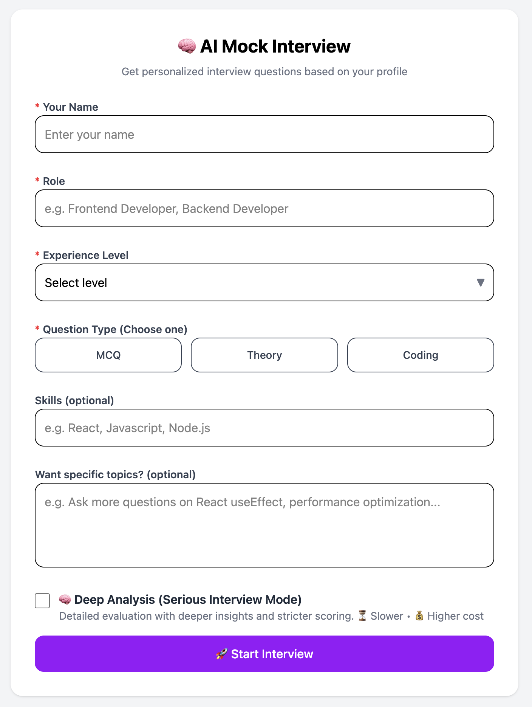
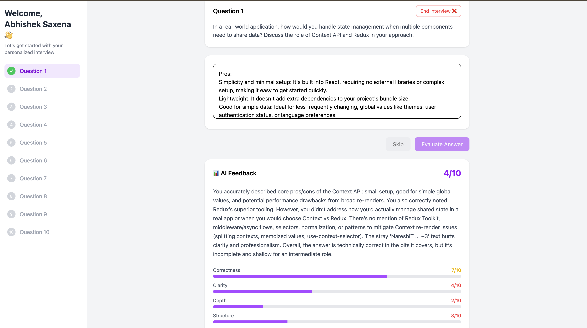

<div>
  <h1>🧠🎤 AI Mock Interviewer</h1>
  <p>
    Generate personalized interview questions from your profile <b>and</b> get AI feedback on your answers.
  </p>
</div>

---

## Setup Screen



---

## Interview Screen



## 🌐 **Live Demo:** https://ai-mock-interviewer-omega-ruddy.vercel.app/

## ✨ What it does

- 👤 Collects your <b>name</b>, <b>role</b>, <b>experience level</b>, desired <b>question type</b>, and optional <b>skills</b>/<b>context</b>
- 🎯 Generates a set of interview questions (MCQ / Theory / Coding)
- 🧠 Evaluates your responses with structured scoring + detailed feedback
- ⚡ Includes a <b>Deep Analysis</b> mode for stricter, more insightful evaluation

---

## 🧩 Features (at a glance)

- 📚 Profile-aware question generation (questions vary by experience level)
- 🧾 Two-question flows:
  - 🟢 MCQ: instant correctness checking (no extra API call)
  - 🟣 Theory/Coding: AI-driven evaluation with a score breakdown
- 📊 Score breakdown categories:
  - Correctness
  - Clarity
  - Depth
  - Structure
- 🔁 Shows a final “Interview Summary” after you submit all questions

---

## 🛠️ Tech Stack

- 🐍 Backend: <b>FastAPI</b> + <b>OpenAI</b> (via `openai`)
- 🌐 Frontend: <b>React</b> + <b>Vite</b>
- 🎨 Styling: <b>Tailwind CSS</b>
- 🔌 Integration:
  - `POST /generate-questions` → question generation
  - `POST /evaluate-answer` → evaluation feedback

---

## 🏗️ Project Structure

- `backend/` — FastAPI server + AI logic
  - `backend/main.py` — API routes
  - `backend/services/ai_service.py` — prompt + OpenAI calls
- `src/` — React app
  - `src/api/api.js` — API client (calls backend endpoints)
  - `src/components/` — interview UI (setup → interview → results)

---

## 🚀 Setup & Run

### 1) Backend (FastAPI)

From the project root:

1. Install dependencies:
   ```bash
   cd backend
   pip install -r requirements.txt
   ```
2. Configure your OpenAI key:
   - Edit `backend/.env` and set:
     - `OPENAI_API_KEY=your_key_here`
3. Run the server:
   ```bash
   uvicorn main:app --reload --host 127.0.0.1 --port 8000
   ```

### 2) Frontend (React)

1. Install deps and start:
   ```bash
   cd ..
   npm install
   npm run dev
   ```
2. The frontend expects the backend at:
   - `http://127.0.0.1:8000`

---

## 📡 API Reference

### `POST /generate-questions` 🤖

Generates questions based on your profile.

**Request body** (`InterviewRequest`):

```json
{
  "name": "Abhishek",
  "role": "Frontend Developer",
  "expLevel": "Beginner | Intermediate | Expert",
  "questionType": "MCQ | Theory | Coding",
  "skills": "optional string",
  "context": "optional string",
  "isDeep": false
}
```

**Response**:

```json
{
  "success": true,
  "data": {
    "questions": [
      /* question objects */
    ]
  }
}
```

### `POST /evaluate-answer` 🧾

Evaluates your answer using AI (Theory/Coding flow).

**Request body** (`EvaluationRequest`):

```json
{
  "question": "current question text",
  "answer": "your answer text",
  "role": "Frontend Developer",
  "expLevel": "Beginner | Intermediate | Expert"
}
```

**Response**:

```json
{
  "success": true,
  "data": {
    "breakdown": {
      "correctness": 1,
      "clarity": 1,
      "depth": 1,
      "structure": 1
    },
    "feedback": "detailed feedback",
    "strengths": "what was good",
    "improvements": "what to improve",
    "correct_approach": "ideal answer summary"
  }
}
```

---

## 💡 Notes

- `Deep Analysis (Serious Interview Mode)` toggles a more strict generation approach (uses a “deeper” model path).
- CORS is enabled in the backend so the React dev server can call the API easily during development.
- For best results: provide specific `context` (e.g., “ask more on React hooks + performance”).
